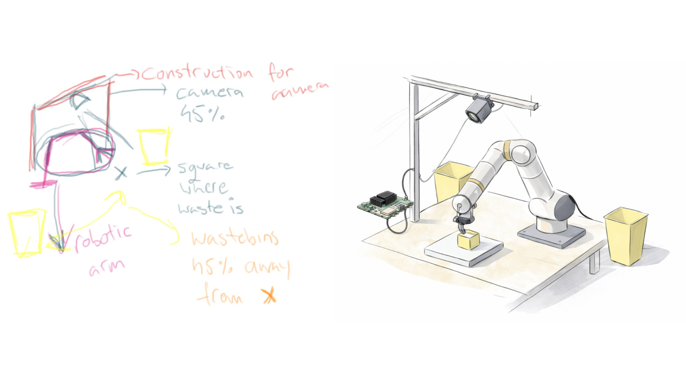
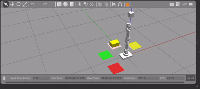

# ROS-pick-and-place-waste-sorting
 
This repository is part of my **Master’s Thesis Project**.  

The goal is to build a **SmartBin – a YOLO-based garbage sorting system implemented on ROS**, integrated with an **Axelera AI accelerator** for edge inference.  

🚧 **Build in Progress** 🚧  

Since I don’t currently have access to a robotic hand, the manipulation part is implemented in a **simulator**. This allows me to abstract away hardware-specific issues (grippers, calibration, mechanical failures, etc.) and focus on perception and system integration.  

The **camera and accelerator are real** 😅, so detection and inference are performed under realistic hardware conditions.

---

## 🗑️ SmartBin-YOLO  

SmartBin is designed as a modular, ROS-based smart waste sorting system that combines:

- Real-time object detection (YOLO)  
- Edge AI acceleration (Axelera AI)  
- Simulated robotic manipulation  
- Real camera input  

The idea is to create a scalable perception-to-action pipeline that could later be deployed on real robotic hardware.

Full system sketch (handmade 👈 and prompted with a generative AI model 👉)

---
### 📦 Dataset  

🔗 **[Garbage Detection Dataset (Kaggle)](https://www.kaggle.com/datasets/viswaprakash1990/garbage-detection)**  

For the tunning of the Yolo networks, this project uses a publicly available garbage detection dataset from Kaggle, containing annotated images across multiple waste categories.  
It provides bounding box labels for real-world waste objects.

### 👀 YOLO Model Exploration

#### Phase 1 – Model Comparison

Compared YOLOv5 and YOLOv8 (nano and small variants) under identical conditions with no hyperparameter tuning.  
Focused on: speed, model size, mAP, precision/recall.

**Result:** YOLOv8s achieved best overall performance. Dataset imbalance (especially "Paper" class) was the main limiting factor, not architecture.

#### Phase 2 – Dataset Harmonization

Harmonized two YOLO datasets into a clean **4-class taxonomy** (cardboard_paper, glass, metal, plastic).  
Merged cardboard + paper, removed biodegradable, improved label consistency.

**Result:** Enhanced label quality and class structure significantly improved detector robustness — often more impactful than model scaling alone.

---

## ⚙️ System Implementation Status

### Robot Manipulation Simulation (ros_ws)

This module provides a **message-driven robotic manipulation system** that orchestrates the complete pick-and-place workflow. The simulation implements:

- **Motion Planning**: MoveIt2-based joint space and Cartesian planning with collision avoidance
- **Threaded Execution**: Asynchronous pick-and-place cycles preventing blocking of the ROS 2 executor
- **Dynamic Object Management**: Boxes are spawned, manipulated, and deleted per cycle
- **Color-Based Sorting**: Three drop-off zones (green, red, yellow) based on box classification
- **Message-Driven Pipeline**: Subscribes to external number messages (0-3) triggering complete manipulation cycles

Currently operates with a **dummy message sender** for testing. Integration with YOLO detector responses is in progress; detector outputs have been tested independently but full pipeline coupling is under development.

**Credits**: This module was cloned from and adjusted after [santoshbalaji/pick_and_place](https://github.com/santoshbalaji/pick_and_place).

### YOLO Detector Integration (yolo_detector_ros2)

The YOLO detector (non-accelerated, CPU/GPU only) is now part of the integrated ROS flow and is working as a core perception component. It currently runs with a video fake stream (provided by the video stream helper node) and publishes detection results for downstream robotic manipulation.

For more details, see the dedicated [README in ros_ws/src/yolo_detector_ros2](ros_ws/src/yolo_detector_ros2/README.md).

### 🟢 Current Status

- ✅ **Helper nodes** (camera, display, video stream, save annotated) — **running**  
- ✅ **YOLO detector** (phase 1 inference) — **integrated and working**  
- ✅ **Robotic simulation with dummy message sender** — **fully operational**  
- 🔄 **YOLO-to-manipulation integration** — **tested together**

---

More updates coming soon 🚀
---

## TODO

- Implement an accelerator-based inference node (Axelera) with the same interface and flow as the current YOLO detector node.
