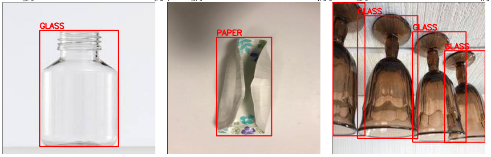
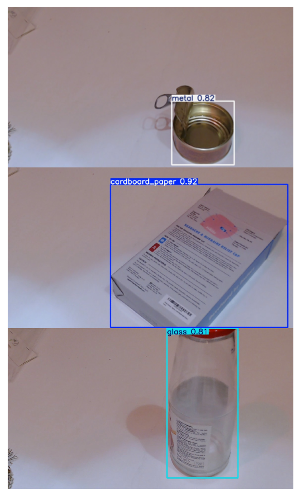

# YOLO Model Exploration

## Phase 1 – Model Comparison

Phase 1 establishes a clean baseline by comparing different YOLO architectures (YOLOv5 and YOLOv8, nano and small variants) under identical conditions.

### Methodology

- **No hyperparameter tuning** — consistent training conditions across all models
- **Image size:** 640px  
- **Epochs:** 100 with early stopping (patience=10)  
- **LR schedule:** cosine annealing  
- **Dataset:** Original Kaggle waste detection (5 classes including biodegradable)  
- **Hardware:** GPU-accelerated training with batch auto-sizing  

### Evaluation Metrics

For each model variant, measured:
- **Speed:** inference time (ms/image) and training time (minutes)
- **Model size:** parameter count and weight file size
- **Detection performance:** mAP@50-95, mAP@50, precision, recall
- **Training efficiency:** test set evaluation time

### Results

| Metric | Winner | Note |
|--------|--------|------|
| **mAP@50-95** | YOLOv8s | Consistently outperformed all variants |
| **Speed** | YOLOv8n & YOLOv5n | Nano variants faster, but lower accuracy |
| **Size** | YOLOv5n | Smallest model, simplest deployment |
| **Generalization** | YOLOv8 | Better than YOLOv5 at same scale |

### Key Findings

- **YOLOv8s achieved the best overall performance**, balancing accuracy and speed
- **Small variants consistently outperformed nano models** — the accuracy gap worth the extra compute
- **YOLOv8 showed slightly better generalization than YOLOv5** across scales
- **Dataset imbalance** (especially the "Paper" class under-representation) was the bottleneck, not model architecture

### Conclusion

This baseline phase confirms that within current YOLO ecosystems, architecture choice is less critical than data quality and class balance for waste detection. This establishes the foundation for Phase 2's focus on data harmonization and taxonomy refinement.

---

## Phase 2 – Dataset Harmonization & YOLOv8

### Overview

Phase 2 improves waste object detection by harmonizing two YOLO-format datasets into a clean **4-class taxonomy** and evaluating performance beyond standard mAP.

**Final classes:**

0 → cardboard_paper  
1 → glass  
2 → metal  
3 → plastic  

### Dataset Engineering

- Loaded two YOLO datasets (original + auxiliary)
- Merged **cardboard + paper**
- Removed **biodegradable**
- Remapped class IDs and cleaned labels
- Preserved train/val/test splits
- Generated unified `data.yaml`
- Merged datasets after taxonomy alignment (not simple concatenation)

**Goal:** reduce ambiguity, increase per-class density, improve robustness.

### Training

- Model: `yolov8s.pt`
- Image size: `640`
- AMP enabled
- No mosaic / mixup / copy-paste
- GPU-aware and memory-safe setup

### Evaluation

**Standard Metrics**
- Precision
- Recall
- mAP@50
- mAP@50-95

**Custom Analysis**
- Detection-level IoU matching
- Per-class precision/recall/F1
- Confusion pair analysis
- Size-based recall (small/medium/large)
- Crowding & isolated-object recall

### Experiment

Compared:
- Baseline (original dataset)
- Harmonized + merged dataset

Measured deltas in precision, recall, and mAP to isolate the impact of taxonomy simplification.

### Key Insight

Improving **label quality and class structure** can significantly enhance detector robustness — often more than model scaling alone.

---

### Example Dataset Images

Below are examples of the dataset used for training and evaluation, showing the diversity and annotation quality of the waste detection task:

  

---

### Results After Fine-Tuning

The following image shows the detection results after fine-tuning the YOLO model on the harmonized dataset:

  

---